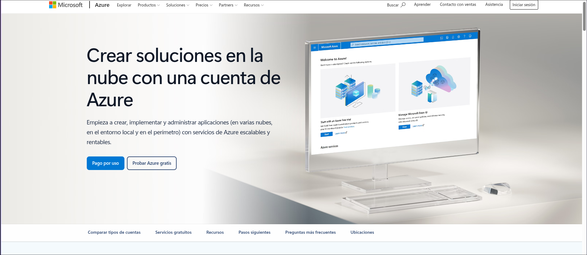
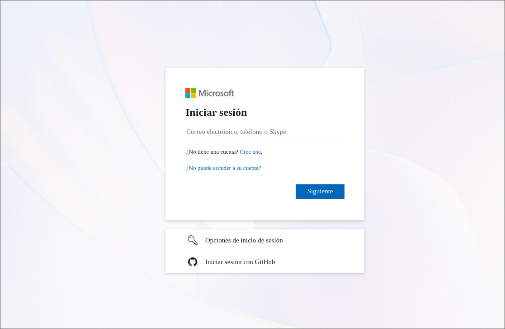
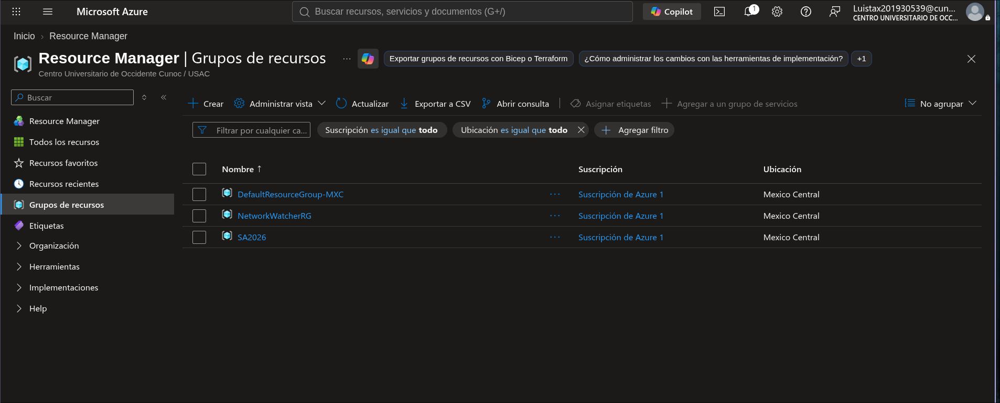
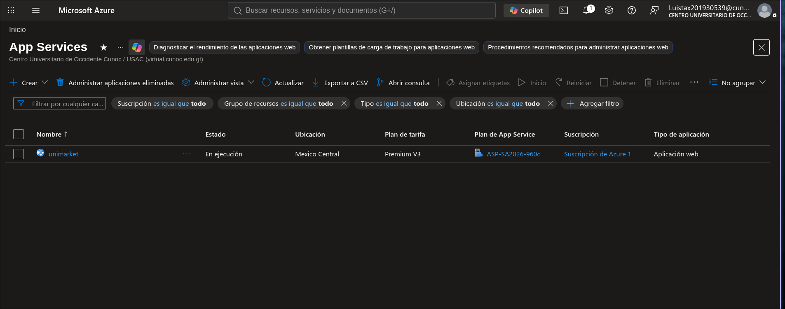
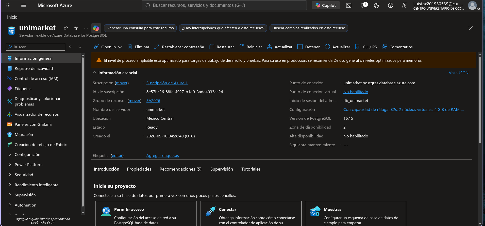
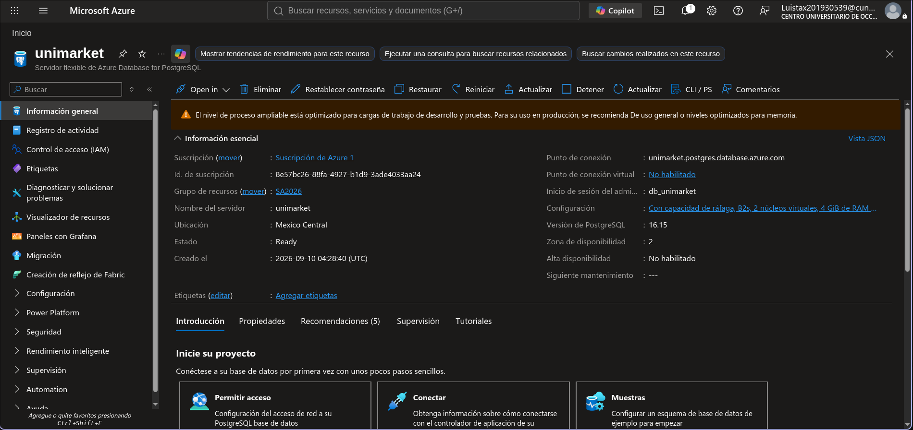
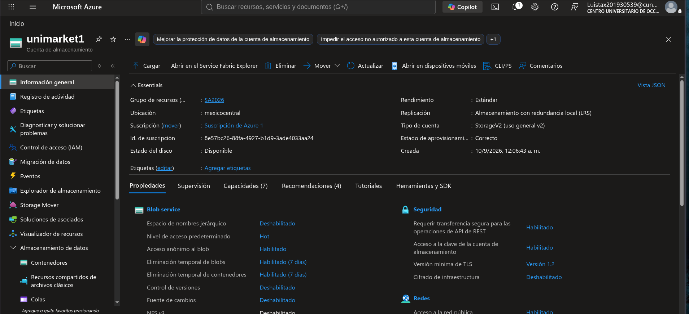
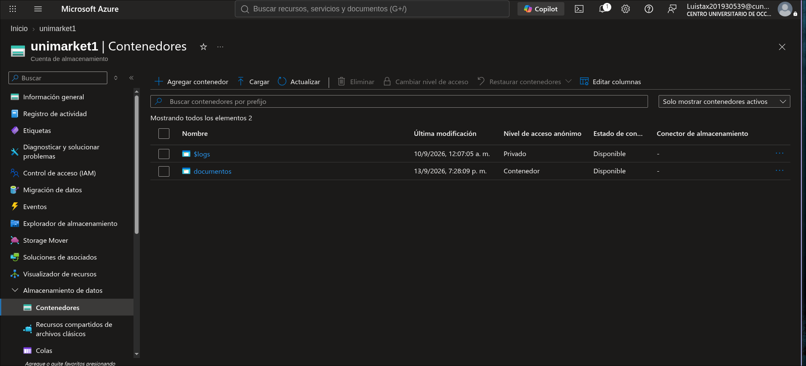
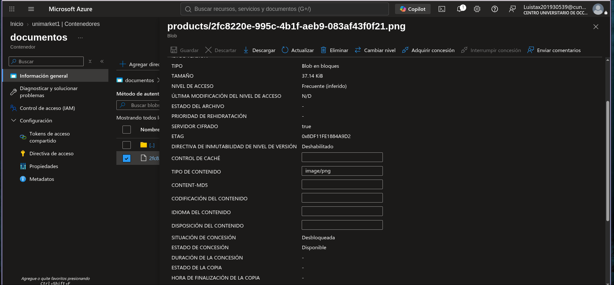

# Guía de Despliegue - Microsoft Azure

## Resumen

| Aspecto | Detalle |
|---------|---------|
| **Proveedor** | Microsoft Azure |
| **Servicios** | App Service + Azure DB PostgreSQL + Blob Storage |
| **Costo mensual** | $66.06 |
| **Free Account** | Sí ($200 por 30 días) |
| **Tiempo estimado** | 1.5 - 2 horas |

---

## 1. Crear Cuenta

1. Ir a https://azure.microsoft.com/free
2. Click "Probar Azure gratis"
3. Iniciar sesión con cuenta Microsoft
4. Agregar método de pago
5. Obtener $200 créditos por 30 días

*Figura 1: Página de inicio de Microsoft Azure*

---

## 2. Iniciar Sesión

1. Ir a https://portal.azure.com
2. Ingresar credenciales de Microsoft
3. Click "Siguiente"

*Figura 2: Pantalla de inicio de sesión de Microsoft*

---

## 3. Crear Resource Group

1. Ir a **Resource Manager > Grupos de recursos > Crear**
2. Nombre: `SA2026`
3. Región: México Central
4. Click "Revisar + crear"

*Figura 3: Grupo de recursos "SA2026" creado*

---

## 4. Crear App Service

1. Ir a **App Services > Crear**
2. Configuración:
   - **Nombre:** `unimarket`
   - **Grupo de recursos:** SA2026
   - **Plan de publicación:** Premium V3
   - **Runtine:** Java 21
3. Click "Revisar + crear"

*Figura 4: App Service "unimarket" en estado "En ejecución"*

---

## 5. Crear Azure Database for PostgreSQL

1. Ir a **Azure Database for PostgreSQL > Crear**
2. Configuración:
   - **Nombre del servidor:** `unimarket`
   - **Grupo de recursos:** SA2026
   - **Versión:** PostgreSQL 16.15
   - **Nivel:** Flexible Server
   - **Capacidad:** B2s (2 núcleos virtuales, 4 GiB RAM)
   - **Ubicación:** México Central
3. Click "Revisar + crear"

*Figura 5: Servidor Azure Database for PostgreSQL "unimarket"*

*Figura 6: Información esencial del servidor PostgreSQL*

**Esperar ~5-10 minutos hasta que el estado sea "Ready".**

---

## 6. Crear Blob Storage

1. Ir a **Storage Accounts > Crear**
2. Configuración:
   - **Nombre:** `unimarket1`
   - **Grupo de recursos:** SA2026
   - **Ubicación:** México Central
   - **Rendimiento:** Estándar
   - **Replicación:** Almacenamiento con redundancia local (LRS)
3. Click "Revisar + crear"

*Figura 7: Storage Account "unimarket1" creado*

---

## 7. Crear Contenedor Blob

1. Ir a **Storage Account > Contenedores**
2. Click "Agregar contenedor"
3. Nombre: `documentos`
4. Nivel de acceso: Contenedor

*Figura 8: Contenedores en Storage Account "unimarket1"*

---

## 8. Verificar Almacenamiento

1. Ir a **Contenedores > documentos**
2. Verificar que se puede subir archivos

*Figura 9: Archivo blob en contenedor "documentos"*

